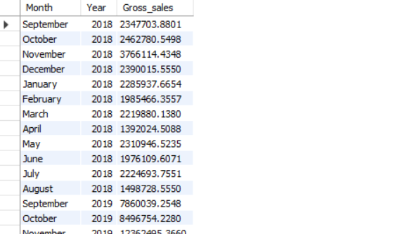

# 📊 Ad-Hoc SQL Insights

This file contains a consolidated set of SQL queries used for extracting insights from AtliQ Mart's retail data warehouse.


<p align="center">   --Request 1 </p>

```sql
SELECT 
    DISTINCT market
FROM dim_customer
WHERE customer = "AtliQ exclusive"
  AND region = "APAC";
```

-- Request 2
```sql
WITH cte1 AS (
    SELECT COUNT(DISTINCT product_code) AS unique_product_2020
    FROM fact_sales_monthly
    WHERE fiscal_year = 2020
), 
cte2 AS (
    SELECT COUNT(DISTINCT product_code) AS unique_product_2021
    FROM fact_sales_monthly
    WHERE fiscal_year = 2021
)
SELECT 
    unique_product_2020,
    unique_product_2021,
    (unique_product_2021 - unique_product_2020) * 100 / unique_product_2020 AS pct_change
FROM cte1
CROSS JOIN cte2;
```

-- Request 3
```sql
SELECT 
    segment,
    COUNT(DISTINCT product_code) AS Product_count
FROM dim_product
GROUP BY segment
ORDER BY Product_count DESC;
```

-- Request 4
```sql
WITH unique_products AS (
    SELECT
        p.segment, 
        COUNT(DISTINCT CASE WHEN fiscal_year = 2020 THEN s.product_code END) AS product_count_2020,
        COUNT(DISTINCT CASE WHEN fiscal_year = 2021 THEN s.product_code END) AS product_count_2021
    FROM fact_sales_monthly s
    JOIN dim_product p ON s.product_code = p.product_code
    GROUP BY p.segment
)
SELECT 
    *,
    product_count_2021 - product_count_2020 AS difference
FROM unique_products
ORDER BY difference DESC;
```

-- Request 5
```sql
(SELECT 
    p.product_code,
    p.product,
    m.manufacturing_cost
 FROM dim_product p
 JOIN fact_manufacturing_cost m ON p.product_code = m.product_code
 ORDER BY m.manufacturing_cost DESC
 LIMIT 1)
UNION
(SELECT
    p.product_code,
    p.product,
    m.manufacturing_cost
 FROM dim_product p
 JOIN fact_manufacturing_cost m ON p.product_code = m.product_code
 ORDER BY m.manufacturing_cost ASC
 LIMIT 1);
```

-- Request 6
```sql
WITH cte1 AS (
    SELECT *
    FROM fact_pre_invoice_deductions
    JOIN dim_customer c USING (customer_code)
    WHERE fiscal_year = 2021
      AND c.market = 'india'
)
SELECT 
    customer_code,
    customer,
    CONCAT(ROUND(AVG(pre_invoice_discount_pct) * 100, 2), "%") AS avg_discount_pct
FROM cte1
GROUP BY customer_code, customer
ORDER BY avg(pre_invoice_discount_pct) * 100 DESC
LIMIT 5;
```

-- Request 7
```sql
SELECT
    MONTHNAME(s.date) AS Month,
    s.fiscal_year AS Year,
    SUM(sold_quantity * gross_price) AS Gross_sales
FROM fact_sales_monthly s
JOIN fact_gross_price g ON s.product_code = g.product_code
JOIN dim_customer c ON s.customer_code = c.customer_code
WHERE customer = "AtliQ Exclusive"
GROUP BY Month, Year
ORDER BY Year ASC;
```

-- Request 8
```sql
SELECT 
    CASE    
        WHEN MONTH(date) IN (9, 10, 11) THEN "Q1"  
        WHEN MONTH(date) IN (12, 1, 2) THEN "Q2" 
        WHEN MONTH(date) IN (3, 4, 5) THEN "Q3"     
        WHEN MONTH(date) IN (6, 7, 8) THEN "Q4" 
    END AS Quarter,
    SUM(sold_quantity) AS total_sold_qty 
FROM fact_sales_monthly 
WHERE fiscal_year = 2020 
GROUP BY Quarter
ORDER BY total_sold_qty DESC;
```

-- Request 9
```sql
WITH cte1 AS (
    SELECT
        c.channel,
        ROUND(SUM((s.sold_quantity * g.gross_price) / 1000000), 2) AS gross_sales_mln
    FROM dim_customer c
    JOIN fact_sales_monthly s ON c.customer_code = s.customer_code
    JOIN fact_gross_price g ON s.product_code = g.product_code
    WHERE s.fiscal_year = 2021
    GROUP BY c.channel
)
SELECT 
    *,
    CONCAT(ROUND(gross_sales_mln * 100 / (SELECT SUM(gross_sales_mln) FROM cte1), 2), " %") AS pct_contribution
FROM cte1
ORDER BY pct_contribution DESC;
```

-- Request 10
```sql
WITH cte1 AS (
    SELECT 
        p.division,
        s.product_code,
        CONCAT(p.product, " (", p.variant, ")") AS product, 
        SUM(s.sold_quantity) AS total_sold_qty,
        RANK() OVER(PARTITION BY p.division ORDER BY SUM(s.sold_quantity) DESC) AS rank_order
    FROM dim_product p
    JOIN fact_sales_monthly s ON p.product_code = s.product_code
    WHERE fiscal_year = 2021
    GROUP BY p.division, s.product_code, p.product
)
SELECT 
    *
FROM cte1
WHERE rank_order IN (1, 2, 3)
ORDER BY division, rank_order ASC;
```
